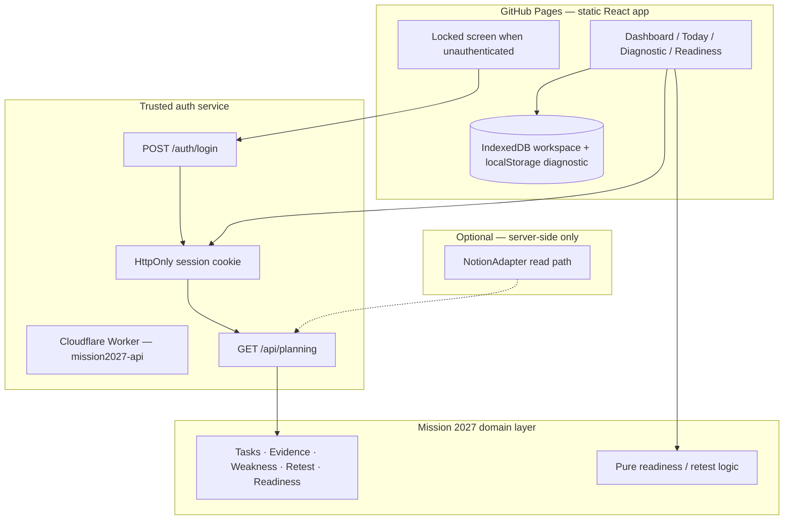

# Diagnostic 360 / Mission 2027 Control Center

An **evidence-driven engineering readiness system** for senior software engineers. It connects structured technical assessment, validated proof, weakness remediation, and explainable readiness — not checkbox productivity.

**Live app (GitHub Pages):** https://fizioh.github.io/diagnostic360/

---

## What this is

Mission 2027 Control Center is a local-first operational cockpit built around a repeatable loop:

```text
PLAN
  → PRACTICE
  → ASSESS
  → EVIDENCE
  → WEAKNESS
  → REMEDIATE
  → RETEST
  → READINESS
```

The application combines:

| Area | Purpose |
|------|---------|
| **Technical diagnostics** | Multi-module Diagnostic 360 sessions with export and external review |
| **Evidence-based readiness** | Scores derived from validated proof, not task completion |
| **Remediation / retest** | Weaknesses → plans → retests → stronger evidence |
| **Engineering proofs** | Track demonstrable artifacts (OSS, products, labs) |
| **Learning tracking** | Reading vs mastery separated explicitly |
| **Senior communication** | Communication and behavioral readiness domains |
| **Mission pipeline** | High-level application pipeline (no hiring probabilities) |
| **Analytics** | Trends, confidence calibration (roadmap) |

### Diagnostic 360 domains (10 modules)

1. Algorithms  
2. React / TypeScript  
3. Django / SQL  
4. Code Review  
5. System Design  
6. Production Incidents  
7. AI Engineering  
8. GIS Architecture  
9. Senior Communication  
10. Technical English  

---

## Architecture



- **Frontend:** React, TypeScript, Vite, hosted on GitHub Pages.  
- **Authentication:** Passphrase verified **only** on the Worker; no secrets in the JS bundle.  
- **Domain layer:** Independent of Notion IDs and transport; integrations use adapters.  
- **Persistence:** Workspace and diagnostic progress stay in the browser; JSON backup/export on `/data`.  
- **Planning data:** Not shipped as public static JSON; served via authenticated API (or optional user import in-browser).

Details: [docs/architecture.md](docs/architecture.md) · [docs/domain-model.md](docs/domain-model.md) · [docs/security-access.md](docs/security-access.md)

---

## Engineering principles

- **Evidence over checkbox completion** — finishing a task does not imply readiness.  
- **Explainable readiness** — drill down to supporting evidence; show *Insufficient evidence* when proof is missing.  
- **Local-first resilience** — diagnostic and workspace survive offline / API outages.  
- **Versioned schemas** — `MissionWorkspaceV1`, review/backup JSON with explicit `schemaVersion`.  
- **Adapter-based integrations** — Notion, auth API, and future backends stay behind boundaries.  
- **No secrets in frontend bundles** — CI runs `build:check` with a bundle secret scan.  
- **CI/CD** — GitHub Actions: lint, test, build on PR; deploy Pages (and Worker API) on `main`.  
- **Review before merge** — independent review and QA gates for meaningful slices.

---

## Security (public repository)

This repo is **public**. The README and codebase must not contain:

- Personal mission data, private career notes, or company-specific pipeline entries  
- Notion database IDs, tokens, or integration secrets  
- GitHub or Cloudflare credentials, access keys, or private URLs  
- Exported personal JSON or internal orchestration credentials  

**Frontend:** Static assets only. `VITE_MISSION_API_URL` is the **public HTTPS origin** of the auth API — not a secret.  

**Backend:** Passphrase verifiers and session signing keys live in **Wrangler secrets** on the Cloudflare Worker ([setup](docs/security-access.md)).  

**Repository audit:** See [docs/public-repository-audit.md](docs/public-repository-audit.md) for the latest scan of tracked files and git history notes.

Report security concerns via GitHub Issues (no secret material in tickets).

---

## Developer setup

```bash
git clone https://github.com/Fizioh/diagnostic360.git
cd diagnostic360
npm install
npm run dev
```

Optional: point the UI at a running auth API (local or deployed):

```bash
# .env.local — public API origin only
VITE_MISSION_API_URL=https://mission2027-api.<your-subdomain>.workers.dev
```

Quality gates:

```bash
npm run lint
npm run test
npm run build        # production build + SPA 404 fallback
npm run build:check  # build + bundle secret scan
```

### Auth API (Cloudflare Worker)

```bash
cd services/mission2027-api
npm install
npm run hash-passphrase -- "your-long-passphrase"
npx wrangler secret put SESSION_SECRET
npx wrangler secret put PASSPHRASE_SALT
npx wrangler secret put PASSPHRASE_HASH
npm run deploy
```

Set GitHub repository variable **`MISSION_API_URL`** to the Worker URL so Pages builds embed the correct public API origin.

---

## Deployment (GitHub Pages)

| Workflow | Trigger | Action |
|----------|---------|--------|
| [ci.yml](.github/workflows/ci.yml) | Pull request → `main` | lint, test, build:check |
| [deploy-pages.yml](.github/workflows/deploy-pages.yml) | Push → `main` | lint, test, build, deploy Pages |
| [deploy-api.yml](.github/workflows/deploy-api.yml) | Push → `main` (API paths) | deploy Cloudflare Worker |

Pages base path: `/diagnostic360/`. Client routes use a copied `404.html` for deep links.

---

## Status / roadmap

- [x] Application foundation (domain, features, Diagnostic 360 shell)  
- [x] GitHub Pages CI/CD  
- [x] Local persistence (IndexedDB + diagnostic localStorage + JSON backup)  
- [x] Secure access control (locked UI + Worker auth; requires Cloudflare secrets + `MISSION_API_URL`)  
- [x] Diagnostic 360 core (10 modules, session, export, external review import)  
- [x] Evidence + weakness + retest loop (domain + UI; integration tests)  
- [x] Explainable readiness engine (domains + target profiles)  
- [ ] Analytics & confidence calibration dashboards  
- [ ] Secure Notion synchronization (trusted backend — not client-side tokens)  

---

## License

See repository defaults; treat diagnostic content and domain logic as an engineering research product, not interview answer keys.
